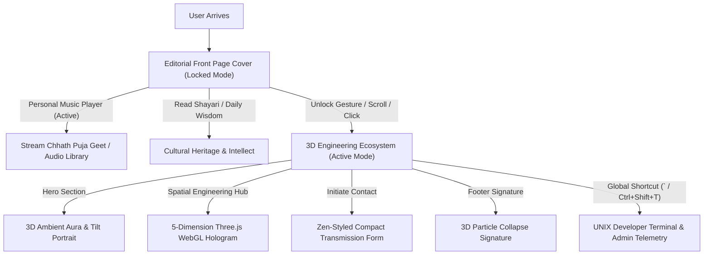
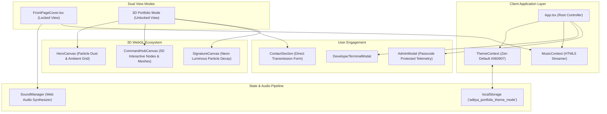
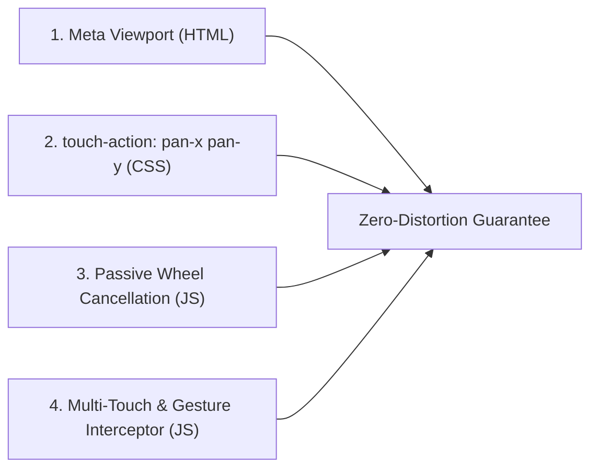

# 🚀 Complete Project Workflow & Technical Architecture Guide
**Project:** Aditya Kumar — Ultra-Luxury Dual-Engine 3D Engineering Portfolio  
**Author / Engineer:** Aditya Kumar (Full Stack & Distributed Systems Engineer)  
**Document Type:** End-to-End System Blueprint & Development Journey (Basic to Advanced)

---

## 📑 Table of Contents
1. [Executive Summary & Product Vision](#1-executive-summary--product-vision)
2. [Requirement Journey & Development Phases](#2-requirement-journey--development-phases)
3. [Core System Architecture & Data Flow](#3-core-system-architecture--data-flow)
4. [Dual-Engine Experience: Cover vs. 3D Spatial Hub](#4-dual-engine-experience-cover-vs-3d-spatial-hub)
5. [Deep Dive: 3D WebGL & Three.js Canvas Engine](#5-deep-dive-3d-webgl--threejs-canvas-engine)
6. [Interactive Subsystems: Audio Engine, Terminal & Admin HUD](#6-interactive-subsystems-audio-engine-terminal--admin-hud)
7. [Contact System & Backend Transmission Pipeline](#7-contact-system--backend-transmission-pipeline)
8. [Anti-Zoom, Responsive & Layout Stabilization Shield](#8-anti-zoom-responsive--layout-stabilization-shield)
9. [Theme Engine & Aesthetic Harmony](#9-theme-engine--aesthetic-harmony)
10. [Directory Structure & Code Map](#10-directory-structure--code-map)
11. [Build, Deployment & Maintenance Guide](#11-build-deployment--maintenance-guide)

---

## 1. Executive Summary & Product Vision

### The Core Objective
Traditional software engineering portfolios are often static, single-page templates that either look generic or require infinite vertical scrolling through disconnected cards. 

This project was conceived as an **Enterprise-Grade, Dual-Engine Spatial Portfolio** that bridges two contrasting worlds:
1. **Editorial Front Page Cover:** A cultural, intellectual, high-editorial magazine-style front page showcasing Aditya’s identity as a **Bihari Engineer**, original Hindi/Maithili Shayari library, curated traditional Chhath Puja folk music by Padma Bhushan Sharda Sinha, and real-time IST telemetry.
2. **3D Spatial Command Hub (ZeBeyond Style):** A high-performance, Three.js-accelerated 3D command deck that unifies 8 architectural sections (Core Systems, Flagship Projects, Tech Stack, AI Lab, Career Milestones, and Engineering Philosophy) into a single ergonomic spatial viewport with zero bloat.



---

## 2. Requirement Journey & Development Phases

The project was constructed iteratively through structured evolutionary phases based on specific architectural requirements:

### Phase 1: High-Performance Foundation & Core Stack
- **Stack Selection:** React 19 + TypeScript 5.9 + Tailwind CSS + Vite 8.
- **Audio Synthesizer:** Custom Web Audio API sound generator (`soundManager.ts`) for mechanical clicks, subtle sweeps, and modal chirps without external audio asset lag.
- **Theme Engine:** Multi-palette context system (`stars`, `matrix`, `zen`, `aurora`, `network`).

### Phase 2: Cultural Front Page Cover & Song Player
- **Editorial Newspaper UI:** Designed a high-contrast editorial front cover (`FrontPageCover.tsx`) featuring real-time UTC+5:30 clocks, live weather simulation, daily tech quotes, and Hindi shayari library (Sad, Love, Emotional, Breakup, Motivational).
- **Personal Music Player:** Dedicated HTML5 continuous audio streaming engine (`PersonalMusicPlayer.tsx` + `MusicContext.tsx`) streaming iconic regional classics including *Kaanche Hi Baans Ke Bahangiya* by Sharda Sinha.

### Phase 3: Developer Terminal & Admin Live Telemetry
- **Terminal Emulator:** Built an interactive Unix shell modal (`DeveloperTerminalModal.tsx`) supporting commands like `help`, `cat`, `system`, `nav`, `theme`, and `admin`.
- **Passcode Protection:** Recruiter / client passcode authorization system allowing Aditya to grant read-only real-time broadcast and chat access while keeping administrative mutations securely protected.

### Phase 4: 3D Spatial Hub Consolidation (ZeBeyond Style)
- **The Problem:** 8 separate vertical sections (`Systems`, `Work`, `Skills`, `AI Lab`, `Experience`, `Education`, `Philosophy`, `Turnaround`) consumed over 8,000 pixels of vertical scrolling, causing user fatigue.
- **The Solution:** Consolidated all 8 sections into a single **5-Dimension Spatial Command Hub** (`SpatialEngineeringHub.tsx` + `CommandHubCanvas.tsx`):
  1. *Dimension 01: Core Systems* (Backend, Frontend, Data Pipeline, Realtime, AI, DevOps)
  2. *Dimension 02: Selected Work* (CRM, Architecture nodes, Problem-Solution-Impact dossiers)
  3. *Dimension 03: Tech Stack & AI Lab* (Interactive nodes, Spring Boot, Go, K8s, LLM pipelines)
  4. *Dimension 04: Career & Milestones* (Interactive ascending spire, TAM Infosoft, ThinkNEXT, MCA, BSc)
  5. *Dimension 05: Engineering Philosophy* (Build, Design, Explore tenets)

### Phase 5: Contact Page & Unified Zen Theme
- **Contact Redesign:** Removed bloated boilerplate ("Availability & Turnaround" and long subtitles), transformed the "Tell Me About Your Project" form into a compact, ergonomic glass card with interactive inquiry pills.
- **Zen Palette Unification:** Harmonized all sections to use the **Zen obsidian/emerald theme** (`#060907` background, emerald `#10b981` accents, and mint highlights).
- **Music Player Scoping:** Restricted the music player exclusively to the Front Page Cover, automatically unmounting it when entering 3D space.

### Phase 6: Anti-Zoom & Anti-Distortion Shield
- **The Problem:** Accidental pinch-to-zoom on phones, trackpad pinch on laptops, or scrolling over 3D canvases caused distortion, layout breakage, and trapped scroll wheels.
- **The Solution:** Engineered a full-spectrum zoom lockdown via viewport meta configuration, CSS touch-actions, passive wheel cancellation on Ctrl/trackpad pinches, multi-touch event filtering, and camera focal locking.

---

## 3. Core System Architecture & Data Flow



---

## 4. Dual-Engine Experience: Cover vs. 3D Spatial Hub

### Mode A: Editorial Front Page Cover (`viewMode === 'cover'`)
- **Visual Style:** Luxury monochromatic editorial print with warm gold / brass micro-accents.
- **Core Elements:**
  - Full-screen height (`h-screen overflow-hidden`) with zero body overflow.
  - Live IST time ticker and real-time active indicators.
  - HD Aditya portrait card with high-fashion lighting.
  - Bilingual cultural identity banner ("Bihari Engineer").
  - Hindi Shayari Library with category filters (Breakup, Sad, Love, Motivational).
  - Floating `PersonalMusicPlayer`: plays Sharda Sinha's timeless Chhath Puja geet with audio controls and animated vinyl turntable disc.
  - **Unlock Mechanisms:** Click "Unlock 3D Space", double-finger trackpad upward swipe, or mouse wheel scroll.

### Mode B: 3D Spatial Command Deck (`viewMode === '3d'`)
- **Visual Style:** Deep Zen obsidian (`#060907`) with glowing emerald, cyan, and teal neon vectors.
- **Header:** Sticky dynamic navbar with instant "RETURN TO COVER" toggle, theme cycler, and terminal launcher.
- **Hero Section:** 3D interactive floating avatar with mouse tilt physics (`rotateX`, `rotateY`) and ambient aura.
- **Spatial Engineering Hub:** 5-Dimension WebGL command center with real-time telemetry stats (99.99% SLA, <45ms P99, 250k+ QPS).
- **Contact Section:** Compact, high-efficiency inquiry form with instant clipboard copy and email integration.
- **Footer Signature:** Luminous Three.js particle collapse animation signing Aditya's name upon reaching the page bottom.

---

## 5. Deep Dive: 3D WebGL & Three.js Canvas Engine

### The Interactive Hologram (`CommandHubCanvas.tsx`)
The 3D Hub renders distinct procedural geometries depending on the active dimension:

| Dimension | 3D Visualization Object | Three.js Geometry & Material | Interaction Behavior |
| :--- | :--- | :--- | :--- |
| **01. Core Systems** | Central Cybernetic Wireframe Orb + 6 Orbital Satellites | `IcosahedronGeometry` (wireframe) + `OctahedronGeometry` with metallic roughness 0.1 | Drag to orbit scene; click satellite to focus subsystem dossier |
| **02. Selected Work** | 3-Tier Distributed Architecture Stack | Stratified `BoxGeometry` platforms with cyan wireframe borders | Click any tier to launch the 3D Architecture Inspector Modal |
| **03. Tech Stack & AI** | Multi-axis Gyroscopic Orbital Rings & Planetary Orbs | Concentric `TorusGeometry` rings + procedural canvas-textured text sprites | Click orbs to inspect Spring Boot, Go, K8s, or LLM AI nodes |
| **04. Career Spire** | Ascending Hexagonal Checkpoint Tower | Tapered central `CylinderGeometry` spire with floating milestone disks | Click milestones to inspect TAM Infosoft, ThinkNEXT, and degree milestones |
| **05. Philosophy** | Dual-Layer Sacred Geometry Dodecahedron | Outer wireframe `DodecahedronGeometry` rotating counter to inner glowing gem | Ambient dual-axis rotation reflecting engineering harmony |

### Memory Management & 60 FPS Performance
- **Disposal on Unmount:** Every Three.js buffer geometry, material, and canvas texture is explicitly traversed and disposed in `useEffect` cleanup to guarantee zero WebGL context leaks.
- **Pixel Ratio Clamping:** `renderer.setPixelRatio(Math.min(window.devicePixelRatio, 2))` prevents mobile GPUs with 3x/4x DPR from overheating.
- **Locked Focal Length:** Camera distance is pinned at `z = 9.5`, preventing unintended scroll traps.

---

## 6. Interactive Subsystems: Audio Engine, Terminal & Admin HUD

### 1. Web Audio Synthesizer (`soundManager.ts`)
Instead of downloading external WAV/MP3 sound effects for clicks, the portfolio uses the browser's native `AudioContext` to generate procedural frequencies:
```ts
// Example: Subtle 850Hz sine pulse for mechanical tactile clicks
const osc = ctx.createOscillator();
const gain = ctx.createGain();
osc.type = 'sine';
osc.frequency.setValueAtTime(850, ctx.currentTime);
gain.gain.exponentialRampToValueAtTime(0.001, ctx.currentTime + 0.04);
```

### 2. Personal Music Streaming Engine (`MusicContext.tsx`)
- Persistent HTML5 Audio instance with event listeners for `onended`, `onerror`, and continuous playback.
- Pre-loaded with regional classics:
  1. *Kaanche Hi Baans Ke Bahangiya* (Sharda Sinha)
  2. *Kelwa Ke Paat Par*
  3. Additional curated tracks
- **Strict Scope:** Mounted **only** when `viewMode === 'cover'`.

### 3. Developer Terminal (`DeveloperTerminalModal.tsx`)
- Triggered by pressing `` ` `` (tilde) or `Ctrl + Shift + T`.
- Fully functional command parser supporting:
  - `help`: Lists all CLI commands.
  - `nav <section>`: Smoothly scrolls to target section.
  - `theme <zen|matrix|stars>`: Switches palette instantly.
  - `admin`: Requests access passkey for administrative telemetry.
  - `clear`: Flushes the terminal screen.

### 4. Admin Telemetry & Passcode Gate (`AdminModal.tsx`)
- Allows Aditya to enter an administrative passcode.
- Provides recruiters and verified visitors with real-time project metrics, live project progress, and read-only updates.

---

## 7. Contact System & Backend Transmission Pipeline

### Streamlined UX & Architecture (`ContactSection.tsx`)
The Contact section follows an executive, high-conversion design:
1. **Interactive Category Pills:** User selects their intent with 1 click:
   - `💼 Full-Time Role`
   - `🏛️ Backend Architecture`
   - `🌐 Full-Stack Web App`
   - `⚡ Realtime Streaming`
   - `🤖 AI & Automation`
   - `💡 System Consultation`
2. **Compact Form Grid:** 2-column input layout (`Name`, `Email`), single-line `Subject`, and 3-row `Message` textarea.
3. **P99 SLA Guarantee Card:** Displays direct email (`aditya@example.com`) with instant 1-click clipboard copy feedback ("Copied!").
4. **Validation & API Dispatch:** Validates email RFC patterns and dispatches asynchronously to `apiService.sendContactMessage()`.

---

## 8. Anti-Zoom, Responsive & Layout Stabilization Shield

To ensure absolute visual integrity across phones, tablets, laptops, and ultra-wide monitors, a 4-tier Anti-Zoom Shield is enforced:



1. **Viewport Meta Configuration (`index.html`):**
   ```html
   <meta name="viewport" content="width=device-width, initial-scale=1.0, maximum-scale=1.0, user-scalable=no, shrink-to-fit=no" />
   ```
2. **CSS Touch-Action (`index.css`):**
   ```css
   html, body {
     touch-action: pan-x pan-y;
     -webkit-text-size-adjust: 100%;
   }
   ```
   *Disables mobile double-tap and pinch zoom while preserving natural single-finger vertical panning.*
3. **Ctrl + Wheel & Trackpad Pinch Interception (`App.tsx`):**
   Cancels `wheel` events when `e.ctrlKey === true` with `{ passive: false }`.
4. **Keyboard Zoom Shortcut Neutralizer (`App.tsx`):**
   Cancels `keydown` for `Ctrl/Cmd + '+'`, `'-'`, `'='`, `'_'`, `'0'`, `NumpadAdd`, and `NumpadSubtract`.
5. **3D Canvas Wheel Isolation (`CommandHubCanvas.tsx`):**
   Removed scroll-trapping wheel zoom from the canvas, locking camera focal length at `9.5` so page scrolling is seamless.

---

## 9. Theme Engine & Aesthetic Harmony

All sections adhere to the unified **Zen Theme** palette:

| Property | Hex Value | Application |
| :--- | :--- | :--- |
| **Background (`bgHex`)** | `#060907` | Applied across Root container, Hero, Hub, Contact, and Footer |
| **Primary Accent (`primaryHex`)** | `#10b981` | Emerald badges, active buttons, status pings, ambient glows |
| **Secondary Accent (`accentHex`)** | `#34d399` | Mint highlight borders, typography gradients, telemetry pings |
| **Card Surface** | `#0b100d` / 90% | Glassmorphic dossier containers, form cards, and photo frames |
| **Border Tone** | `rgba(255, 255, 255, 0.1)` | Subtle aerospace gridlines and partition dividers |

---

## 10. Directory Structure & Code Map

```
d:\portfolio\frontend\
├── index.html                     # Viewport meta lock & app entry point
├── package.json                   # Dependencies (React 19, Three.js, Lucide, Framer Motion)
├── vite.config.ts                 # Build & bundling configuration
└── src/
    ├── App.tsx                    # Master root orchestrator (Cover vs 3D, Zoom lock, Audio scoping)
    ├── main.tsx                   # React root renderer
    ├── index.css                  # Tailwind styles, typography, touch-action pan-x pan-y
    │
    ├── components/
    │   ├── Navbar.tsx             # Floating aerospace navigation bar with cover return toggle
    │   ├── PersonalMusicPlayer.tsx# Chhath Puja folk music audio widget
    │   ├── DeveloperTerminalModal.tsx # Interactive developer shell
    │   ├── AdminModal.tsx         # Passkey-protected recruiter & admin telemetry
    │   ├── ArchitectureInspectorModal.tsx # 3D system architecture drill-down
    │   ├── ResumeModal.tsx        # PDF & interactive resume viewer
    │   ├── AiAssistantModal.tsx   # Floating AI copilot assistant
    │   └── SocialIcons.tsx        # GitHub, LinkedIn, and social vector icons
    │
    ├── context/
    │   ├── ThemeContext.tsx       # Multi-palette theme state (Zen default #060907)
    │   └── MusicContext.tsx       # Continuous audio streaming provider
    │
    ├── sections/
    │   ├── FrontPageCover.tsx     # Editorial luxury newspaper front cover & Hindi shayari library
    │   ├── HeroSection.tsx        # 3D interactive avatar, ambient aura, bio summary
    │   ├── SpatialEngineeringHub.tsx # 5-Dimension consolidated ZeBeyond command hub
    │   ├── ContactSection.tsx     # Compact luxury project inquiry form & direct channels
    │   └── FooterSignature.tsx    # Luminous Three.js particle collapse signature
    │
    ├── three/
    │   ├── CommandHubCanvas.tsx   # Core 5D WebGL interactive geometry engine
    │   ├── HeroCanvas.tsx         # Atmospheric starfield & neural mesh background
    │   └── SignatureCanvas.tsx    # Particle collapse signature canvas
    │
    └── services/
        ├── audio.ts               # Procedural Web Audio API synthesizer
        └── api.ts                 # Backend transmission & contact message service
```

---

## 11. Build, Deployment & Maintenance Guide

### Development Server
To launch the Vite development server:
```bash
npm run dev
# Server runs on http://localhost:5173
```

### Production Build
To test TypeScript compilation and bundle production assets:
```bash
npm run build
# Compiles via tsc -b && vite build
# Artifacts placed in /dist with 0 errors
```

### Adding New Projects or Tech
1. Open `src/data/portfolioData.ts`.
2. Add your project under `PROJECTS` or system under `ENGINEERING_SYSTEMS`.
3. The `SpatialEngineeringHub` dynamically reads the data and creates 3D visual checkpoints and dossiers automatically!

### Adding New Songs
1. Place audio files in `public/music/<song-name>.mp3`.
2. Register the track inside `src/types/music.ts` or `src/context/MusicContext.tsx`.

---
*Generated for Aditya Kumar — Enterprise Portfolio System 2026.*
